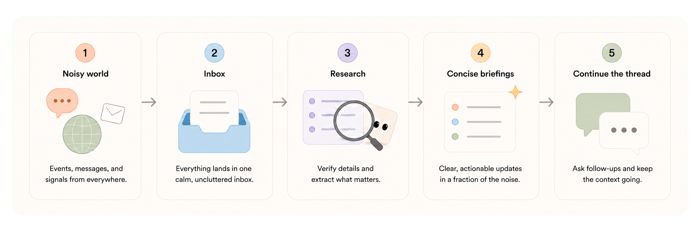
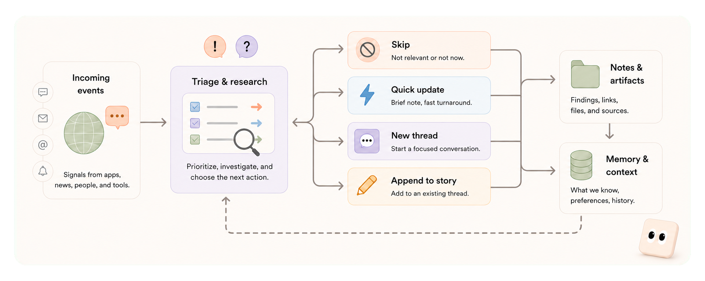

<p align="center">
  
</p>

<h1 align="center">keep-up-with</h1>

<p align="center">
  <strong>A live briefing agent for what changed.</strong><br />
  Watch sources, research events, and send only what is worth your attention.
</p>

---

## What is this?



**keep-up-with** watches the sources you care about and turns the useful parts into short updates or story threads.

If [last30days-skill](https://github.com/mvanhorn/last30days-skill) is the thing you run when you finally ask “what did I miss?”, **keep-up-with** is the version that stays awake. It watches your configured sources, turns new items into events, asks an agent to investigate the ones worth attention, and posts concise updates or threads back into your messaging space.

> Most feeds ask you to read more. **keep-up-with** is built so most items disappear.

It behaves less like a feed reader and more like a careful intern who already knows your topic channels. *Useful one-offs* become short posts. *Dense launches, papers, talks, or messy public reactions* become threads with source visuals attached.

---

## What it does

**keep-up-with** gives Codex a local runtime around the work of staying current:

- **Subscriptions:** X, Reddit, YouTube, RSS feeds, web pages, arXiv, saved links, and other sources.
- **Inbox:** arrivals get deduped, searched, dismissed, or routed.
- **Source tools:** downloads, transcripts, screenshots, media extraction, image crops, repo metadata, and star-history charts.
- **Messaging tools:** short updates, story threads, and follow-up posts.
- **Workspace:** notes, durable context, assets, drafts, and story folders.

The current first-party messaging target is Discord. The setup wizard can create a topic layout so updates land in the right channel instead of one giant catch-all feed.

---

## Sources

**keep-up-with** can watch sources directly, then use the same tools during research.

| Source | What it gives the agent |
| --- | --- |
| **X** | Posts, self-threads, quoted posts, public metrics, and attached media. |
| **Reddit** | Posts, comments, scores, discussion shape, links, and media. |
| **YouTube** | Videos, channels, transcripts, frames, clips, and short demos. |
| **Web and RSS** | Blog posts, changelogs, launch pages, docs, screenshots, and linked pages. |
| **arXiv** | Papers, source bundles, figures, and Markdown exports. |
| **GitHub repos** | READMEs, releases, repo metadata, screenshots, and star-history charts. |
| **Saved context** | Raindrop bookmarks and local browser history, when you enable them. |

The agent should not treat every source equally. A quiet changelog, a loud Reddit thread, and a repo that gained 3,000 stars overnight each mean something different.

---

## How it works



Every event starts in the inbox. Codex can skip it, send a quick update, open a new thread, or append to an existing story. For deeper work, the agent keeps notes, gathers source artifacts, checks nearby discussion, and attaches useful visuals before publishing.

That choice matters: a tiny repo bump should not get the same treatment as a model release, a 45-minute talk, or a policy fight that keeps changing by the hour.

---

## Why this exists

Bookmarks rot. Feeds flood. A weekly “catch me up” pass is useful, but it misses timing: some stories matter because they just happened, because the public reaction is changing, or because a follow-up turns a small item into a bigger one.

**keep-up-with** is built for that gap. It does not try to summarize everything. It tries to decide what deserves your attention, then package that item in a way you can read quickly:

- **What happened**
- **When it first happened,** using relative time when that reads better
- **Who is involved,** especially when the people, companies, or projects are not obvious
- **How much attention it is getting**
- **What supports it:** source visuals, quotes, artifacts, and public discussion
- **Where it belongs:** short post, new thread, or update to an existing story

---

## Quickstart

From a local clone:

```bash
uv sync              # install the project dependencies
uv tool install -e . # expose the kup and kup-cli commands
```

Then run setup:

```bash
kup setup # choose messaging, integrations, presets, and workspace defaults
```

Start the runtime:

```bash
kup start # begin watching sources and handling events
```

---

## Commands

`kup` is for the person running **keep-up-with**. Use it to set up, start, stop, and inspect the local service.

```bash
kup setup  # run the setup wizard
kup start  # start the local runtime
kup status # check the daemon, gateway, thread, and event counts
kup stop   # stop the local runtime
kup reset  # reset runtime state while keeping setup files
```

`kup-cli` is for the agent while it works. It reads events, handles the inbox, fetches source material, and sends messages or threads. You can run it yourself for debugging, but day-to-day control stays in `kup`.

```bash
kup-cli events list          # search or list stored events
kup-cli inbox list           # see pending events waiting for action
kup-cli tools --help         # list source and media tools
kup-cli message send --help  # inspect message publishing options
kup-cli thread create --help # inspect story thread options
```
