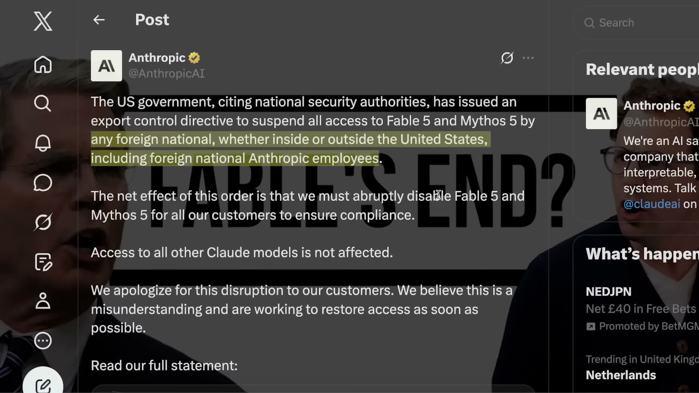
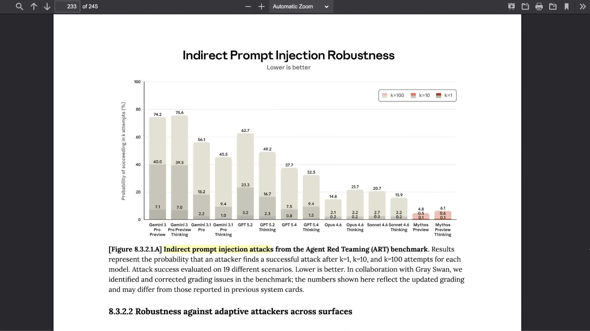
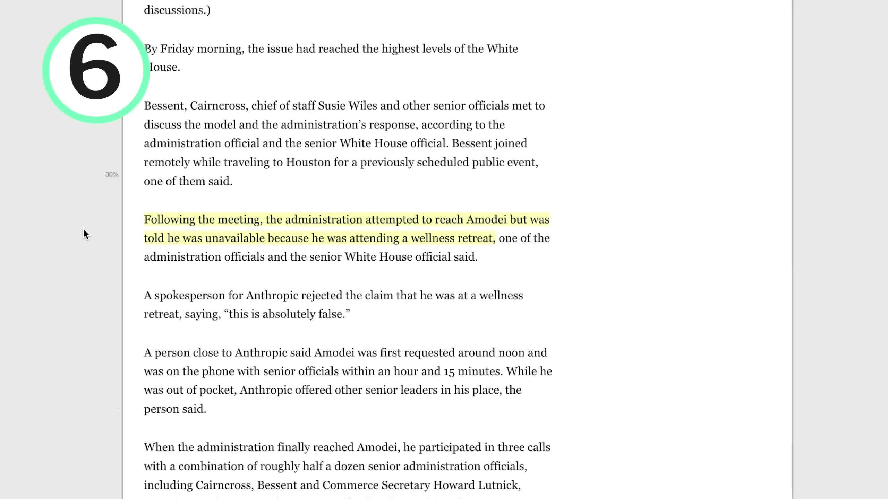
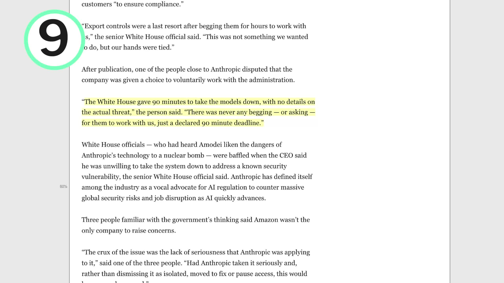
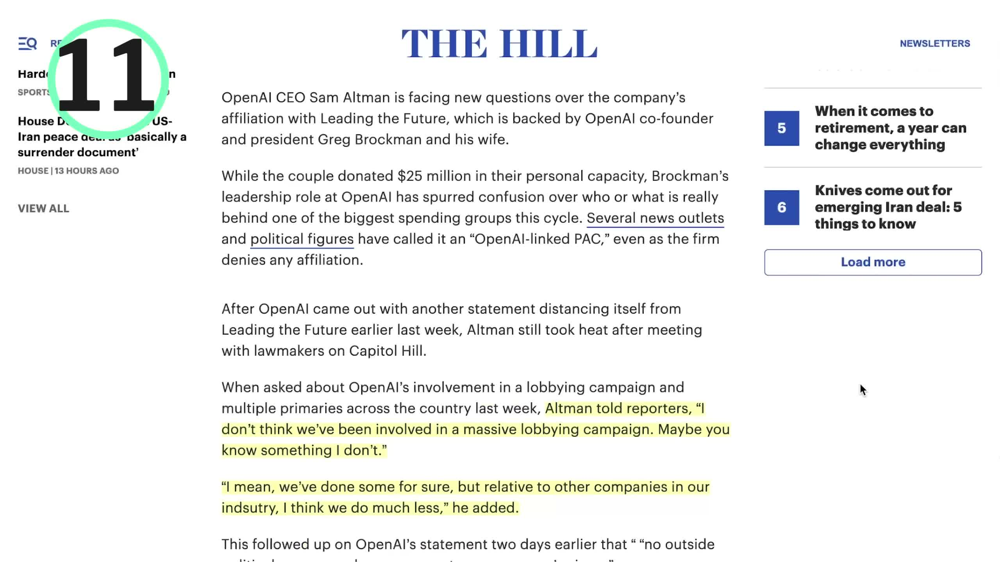

# Reference Thread: AI Explained on Fable/Mythos

## Post 1

AI Explained posted a 13-minute Fable/Mythos video that is more useful as a process map than as another "Fable is blocked" recap.

His read is that the hard question is not whether the model went down. It is why the US government used export-control logic, why Anthropic shut access off for everyone, and whether this gets resolved quickly or turns into a new model-access precedent.

He walks through 11 details. The first one matters: The Information reported that Amazon CEO Andy Jassy and other tech leaders raised jailbreak concerns with the government. AI Explained points out that Amazon is also one of Anthropic's biggest investors and vendors, so this is not a simple rival-trying-to-kill-a-competitor story.

---

## Post 2

The government-process part is where the video spends the most time.

AI Explained connects the decision to National Cyber Director Sean Cairncross, pressure from CEOs such as JPMorgan's Jamie Dimon, and David Sacks saying a trusted partner found a jailbreak. In that version, the government saw a cyber risk, wanted a fast fix, and used export controls because they were the quickest lever.

Then he gives the other side: Anthropic said the reported jailbreak was narrow, simple, and similar to things other frontier models can do. AI Explained keeps returning to one line from the reporting: the government had already decided to impose the control.

---

## Post 3

One visual point from the video is worth keeping: Anthropic's own system-card chart shows Mythos near the low end on indirect prompt-injection success.

That does not prove Fable was safe. It does make the government action look odd if the trigger was a narrow jailbreak that other models may also have. AI Explained pairs this with a Wall Street Journal detail: an outside cybersecurity firm reportedly saw the government report and said the cited behavior looked like defensive vulnerability work, not an obvious cyber weapon.

---

## Post 4

The video also covers the messier reporting around Dario Amodei.

Politico's earlier story said the administration tried to reach Amodei and was told he was at a wellness retreat. Anthropic denied that. Ashley Vance, who said he was reporting at Anthropic at the time, also pushed back.

The important part is the split in accounts: one version says Anthropic refused to fix a serious safety issue; the other says the White House gave Anthropic a short deadline without enough detail.

---

## Post 5

The 90-minute detail is the clearest escalation claim in the video.

AI Explained cites Politico's archived reporting that the White House gave Anthropic 90 minutes to take the models down, with Anthropic-side sources saying there was no detailed threat shared. That is why he treats "quick rollback" and "longer access fight" as very different outcomes.

If this is a narrow safety dispute, Fable can come back after a fix or negotiated process. If it becomes a foreign-national access rule for frontier models, the blast radius is much larger: user ID checks, employee access questions, and pressure on how every lab ships new frontier models.

---

## Post 6

The last section gets into politics and incentives, but it should stay clearly attributed.

AI Explained notes that Anthropic has been publicly more regulation-forward than some peers, that Trump had floated equity stakes in AI companies, and that Anthropic was reportedly absent from those talks. He also points to reporting on OpenAI-linked political spending and Sam Altman's response in The Hill.

That part is not proof of motive. It is useful context for why the same cyber-safety story can read very differently depending on which source you believe.

---

## Post 7

Sources:

- AI Explained video: https://www.youtube.com/watch?v=Qj71N0tBzRo
- Anthropic statement: https://www.anthropic.com/news/fable-mythos-access
- Mythos system card: https://www-cdn.anthropic.com/d00db56fa754a1b115b6dd7cb2e3c342ee809620.pdf
- David Sacks statement: https://x.com/DavidSacks/status/2065853007619588171
- Politico archive cited by AI Explained: https://archive.fo/20260614001605/https://www.politico.com/news/2026/06/13/inside-the-whirlwind-24-hours-that-led-the-white-house-to-slap-export-controls-on-anthropic-00961519#selection-807.1-807.219
