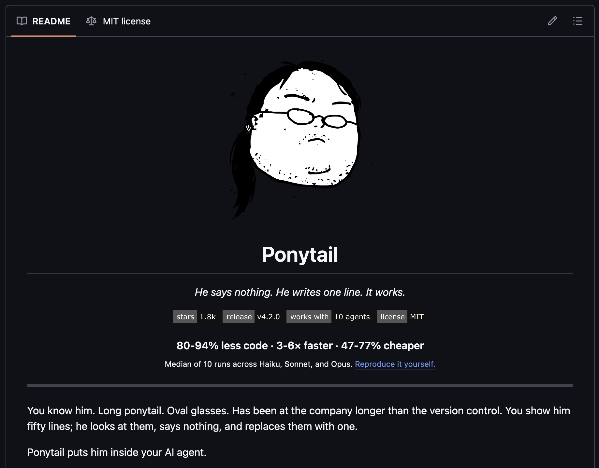
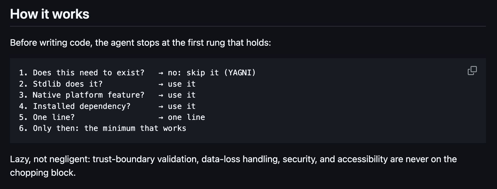
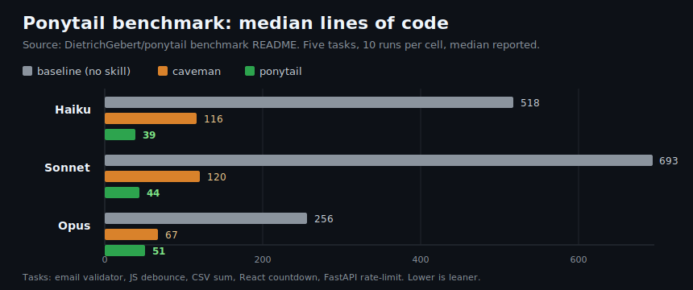
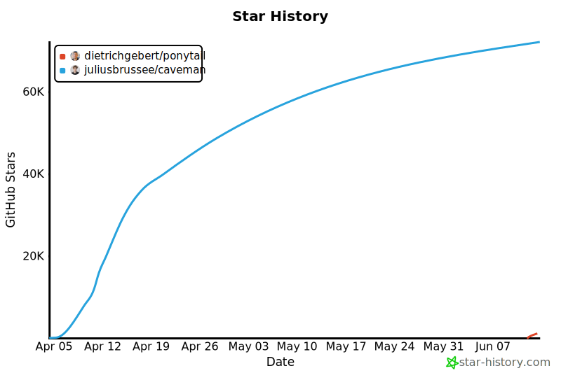

# Reference Short Thread: Ponytail

## Post 1

Ponytail is a Claude Code plugin and portable ruleset that tells coding agents to stop overbuilding.

It was announced on Reddit on June 12, 2026. The repo is `DietrichGebert/ponytail`.

The repo calls it “lazy senior dev mode.” The idea is simple: before writing code, make the agent ask whether the code needs to exist at all.

---

## Post 2

Ponytail makes the agent check the boring options first.

Can the task be skipped? Can the standard library do it? Is there already a platform feature? Is there an installed dependency? Can it be one line?

Only after those fail does it write custom code. The skill also tells the agent not to remove trust-boundary validation, data-loss handling, security checks, accessibility basics, or behavior the user explicitly asked for.

It ships as a Claude Code plugin, and the repo also has adapters for Codex, OpenCode, Cursor, Windsurf, Cline, and other agent surfaces.

---

## Post 3

The closest comparison is `caveman`, but the two projects aim at different parts of the agent.

`caveman` mainly compresses what the agent says. Ponytail tries to change what the agent builds.

The repo benchmark uses five small coding tasks: email validator, JS debounce, CSV sum, React countdown, and FastAPI rate-limit. It runs Haiku, Sonnet, and Opus in three modes: no skill, `caveman`, and Ponytail. Each model/mode/task combination gets 10 runs, then the README reports medians.

The reported median Ponytail outputs were 39/44/51 lines across Haiku/Sonnet/Opus, compared with 518/693/256 lines for the no-skill baseline. The repo summarizes that as 80-94% less code, 47-77% lower cost, and 3-6x faster.

---

## Post 4

The Reddit post had 848 score and 71 comments when this case was built.

On June 14, 2026, GitHub showed `DietrichGebert/ponytail` at 1,853 stars and 84 forks. `JuliusBrussee/caveman`, the older comparison repo, was much larger at 72,221 stars and 4,070 forks.

---

## Post 5

Sources:

- Reddit post: https://reddit.com/r/ClaudeCode/comments/1u3jlo0/i_gave_claude_code_a_lazy_senior_dev_mode_and_it/
- Ponytail repo: https://github.com/DietrichGebert/ponytail
- Benchmark README: https://github.com/DietrichGebert/ponytail/blob/main/benchmarks/README.md
- Ponytail skill file: https://github.com/DietrichGebert/ponytail/blob/main/skills/ponytail/SKILL.md
- Agent portability docs: https://github.com/DietrichGebert/ponytail/blob/main/docs/agent-portability.md
- Comparable project, caveman: https://github.com/JuliusBrussee/caveman
- Star-history chart: generated with `cli tools repo star-history DietrichGebert/ponytail,JuliusBrussee/caveman ...`, backed by `api.star-history.com`.
