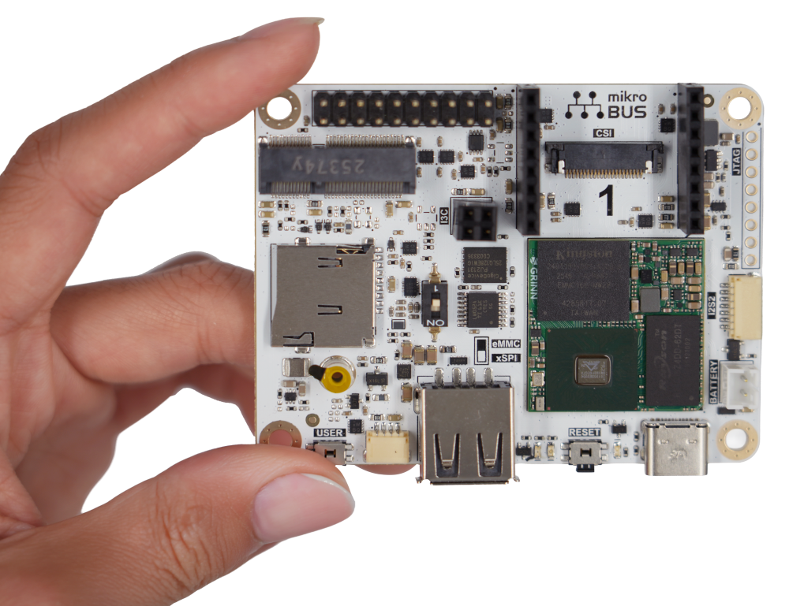

# Reference Message: Coralboard Gemma On Device

Google showed Gemma running fully on a tiny Coralboard, without sending the request to the cloud.

Coralboard is a developer kit for building small on-device AI products: voice controls, translation, camera understanding, object detection, and audio demos. Think smart glasses, earbuds, home cameras, toys, sensors, or appliances that can run a small model locally.

The interesting part is that this uses Google's open-source Coral NPU, not just a normal CPU. The board kit is expected later this summer, and the Coral NPU code/toolchain is already public in `google-coral/coralnpu`.

Source: https://developers.google.com/coral/products

