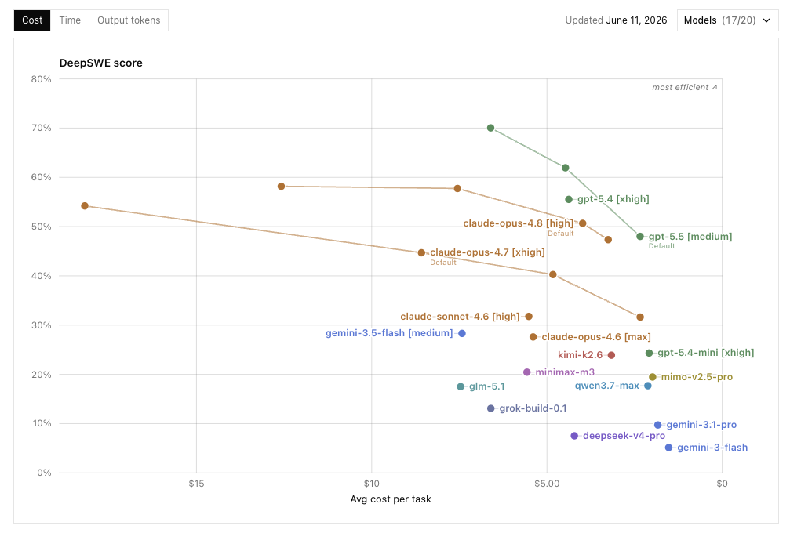
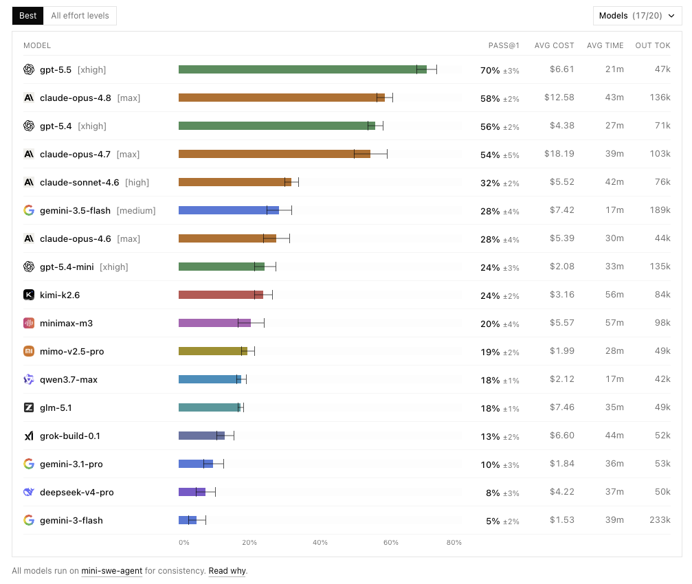
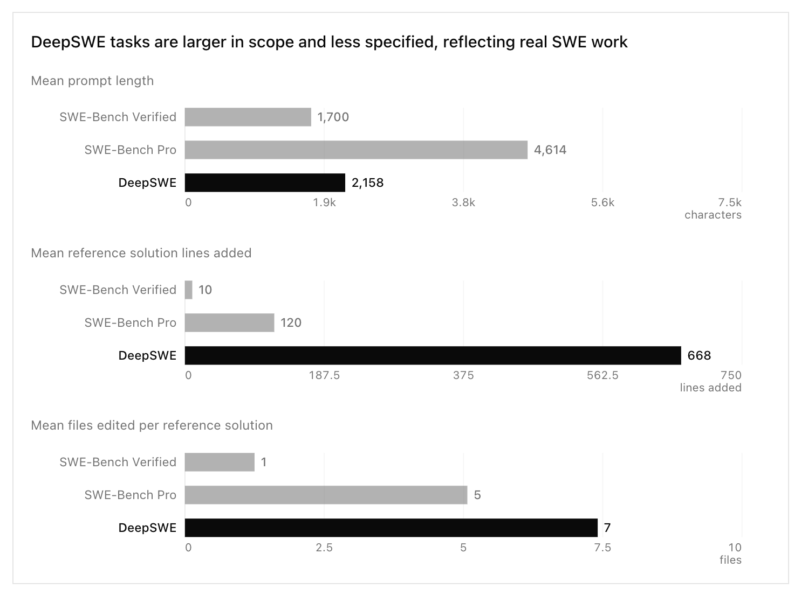
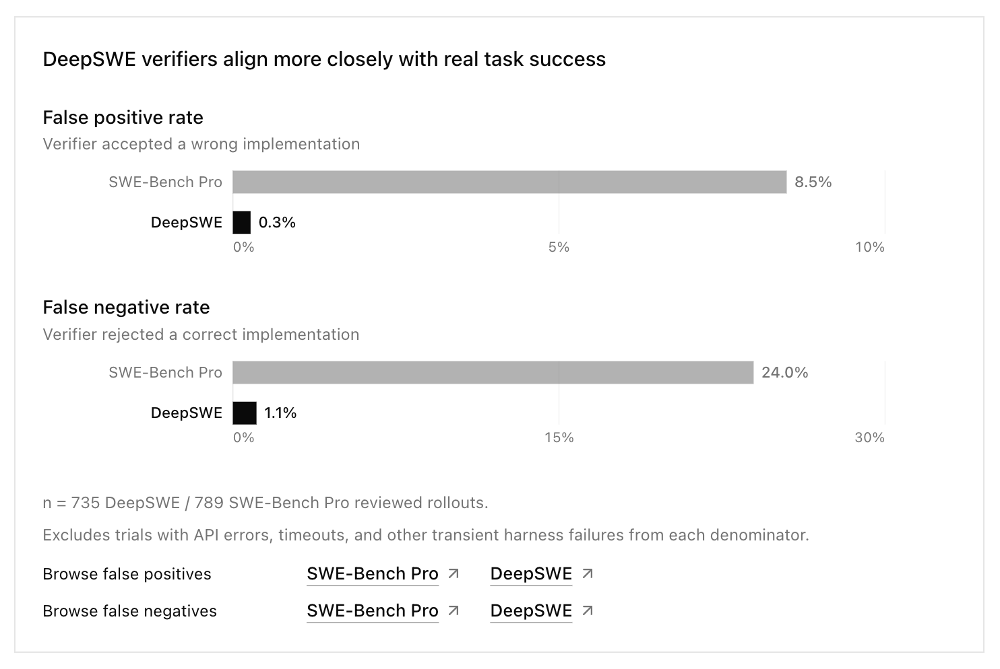
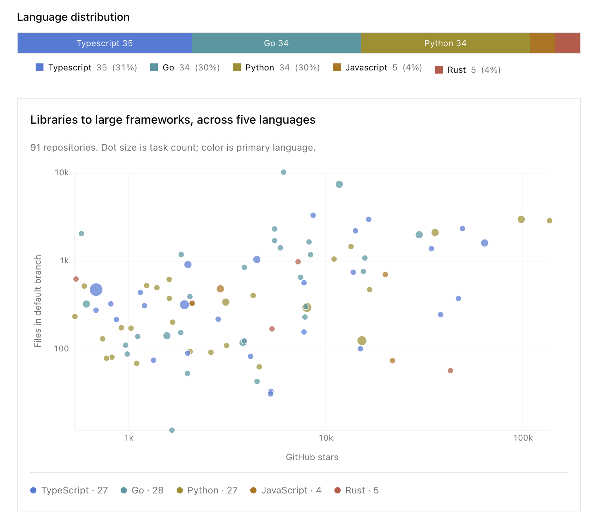
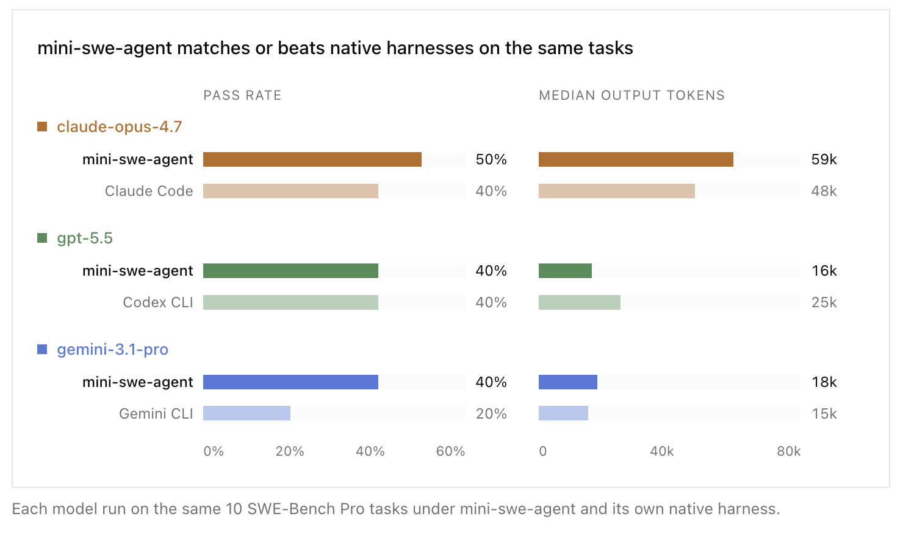
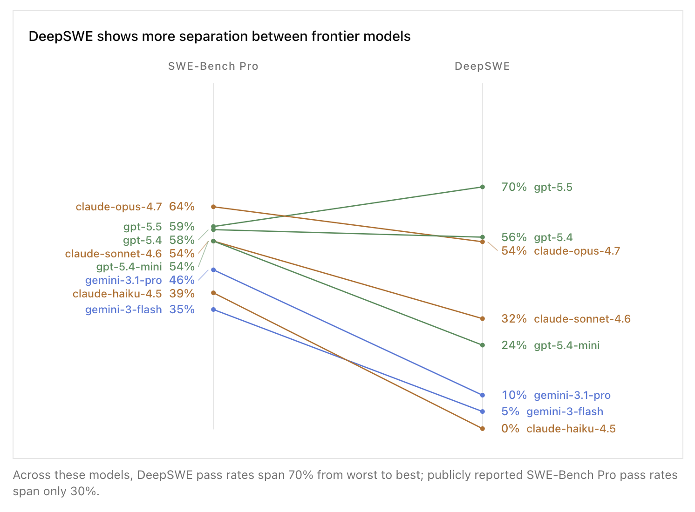

# Reference Thread: DeepSWE

## Post 1

Datacurve released **DeepSWE** on May 26, 2026. It is a coding-agent benchmark focused on longer engineering tasks instead of short one-issue fixes.

The headline is that the scoreboard spreads out more than SWE-Bench Pro. In the current leaderboard crop, **GPT-5.5 leads at 70% pass@1**, followed by **Claude Opus 4.8 at 58%** and **GPT-5.4 at 56%**. The table also shows the cost/time split: GPT-5.5 is first while using less time, cost, and output tokens than Opus 4.8 in this run.

DeepSWE is testing whether agents can handle larger, less scripted software work. The benchmark uses original tasks, real open-source repos, and behavior-focused verifiers instead of public PR fixes and inherited test suites.

---

## Post 2

The task-shape chart explains the difference fastest.

DeepSWE prompts are shorter than SWE-Bench Pro prompts: **2,158 characters** on average versus **4,614** for SWE-Bench Pro.

The work behind the prompt is much larger. DeepSWE reference solutions add **668 lines** across **7 files** on average. SWE-Bench Pro is **120 lines** across **5 files**. SWE-Bench Verified is much smaller: **10 lines** and **1 file**.

That shifts the test toward repo exploration, finding the right implementation surface, and making a larger change without being hand-held.

---

## Post 3

The verifier claim is the part that makes the leaderboard more than a new task set.

Datacurve says DeepSWE tasks are original, then each one gets a prompt, an executable verifier, and a reference solution used during review. The verifier is supposed to check observable behavior instead of matching the reference implementation.

Their audit says SWE-Bench Pro had **8.5% false positives** and **24.0% false negatives** in the reviewed sample. DeepSWE was **0.3%** and **1.1%** on the same style of check.

The numbers still need the usual caution because the audit uses an LLM analyzer. The claim from Datacurve is that DeepSWE reduces bad passes and bad fails, while also making the tasks larger.

---

## Post 4

The corpus is broader than the usual SWE-Bench shape.

DeepSWE has **113 tasks** across **91 active open-source repositories** in five languages: TypeScript, Go, Python, JavaScript, and Rust. The source chart shows the task mix clustered around TypeScript, Go, and Python, with a smaller JavaScript and Rust tail.

The repo spread matters because a benchmark can accidentally become a benchmark for a few famous projects. Datacurve says SWE-Bench Pro Public spans 11 repos and SWE-Bench Verified spans 12. DeepSWE is trying to sample a wider slice of maintained open-source code.

---

## Post 5

The harness choice is the main caveat to keep in mind.

All models run through `mini-swe-agent`. That makes the leaderboard cleaner as a model comparison, because every model gets the same prompt and the same `bash` tool.

It also makes the setup less like daily use. GPT, Claude, Gemini, and other coding products are usually used through model-specific tools and prompts: Codex CLI, Claude Code, Gemini CLI, Cursor, and similar harnesses.

Datacurve ran a small sanity check on 10 SWE-Bench Pro tasks. In that slice, `mini-swe-agent` matched or beat the native harnesses for Claude Opus 4.7, GPT-5.5, and Gemini 3.1 Pro.

That lowers the concern that one model family was obviously harmed by the shared harness. The bigger mapping question remains: these scores come from a shared harness, while most developers use model-native tools.

---

## Post 6

This chart explains why Datacurve is positioning DeepSWE as a benchmark for separating frontier coding agents.

For the listed models, public SWE-Bench Pro scores span about **30 points**. DeepSWE scores span **70 points**. Some models that look close on SWE-Bench Pro separate sharply on DeepSWE: GPT-5.4-mini is **54%** on SWE-Bench Pro but **24%** on DeepSWE; Gemini 3.1 Pro is **46%** versus **10%**.

That spread is why the chart belongs in the opening post. It makes the model ordering look less compressed, especially below the top few frontier configs.

---

## Post 7

The Reddit discussion is small, but it captures two useful reactions.

The r/accelerate post had **122 score and 46 comments** when downloaded. Some people said the ranking matched how the models feel in real coding use:

> Yeah, this benchmark actually tracks about what I feel I get out of real use of the models, except gemini is suspiciously high on it. I never had gemini do that well personally.
> _**r/accelerate comment, 22 upvotes**_

Others pushed on the harness and reasoning-effort setup:

> Sonnet being above opus is odd.
>
> Also, re gpt models being on top, the harness they use has only a single tool: `bash`. GPT models are the most trained to make use of bash.
> _**r/accelerate comment, 4 upvotes**_

> Their methodology lines up with how typical LLM benchmarking is done, but in the real world we use more powerful LLM orchestrators, so these LLMs might perform better than these benchmarks suggest
> _**r/accelerate comment, 1 upvote**_

Public reaction is mixed. People like the benchmark shape, but they immediately care about harness realism, model-native tools, and whether the ranking matches daily coding experience.

---

## Post 8

Sources:

Main sources:
- DeepSWE leaderboard: https://deepswe.datacurve.ai/
- Datacurve blog: https://deepswe.datacurve.ai/blog
- DeepSWE GitHub repo: https://github.com/datacurve-ai/deep-swe

Public discussion:
- r/accelerate thread: https://reddit.com/r/accelerate/comments/1tom0v5/datacurve_released_deepswe_a_new_benchmark_for/

What each source supports:
- Leaderboard: current pass@1, cost, time, output-token table, and latest leaderboard chart.
- Blog: task construction, verifier audit, corpus shape, mini-swe-agent harness choice, limitations, and comparison to SWE-Bench Pro.
- GitHub: benchmark availability and source repository.
- Reddit: public reaction, including the “tracks real use” read and harness/tooling objections.
