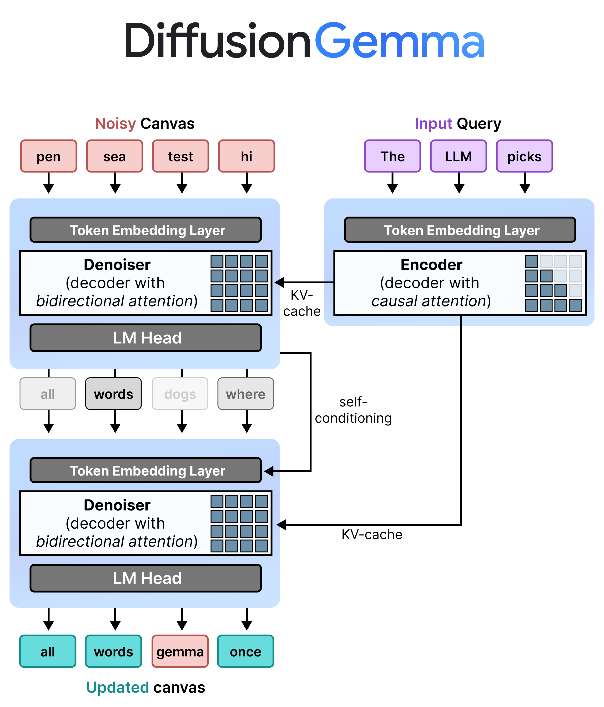
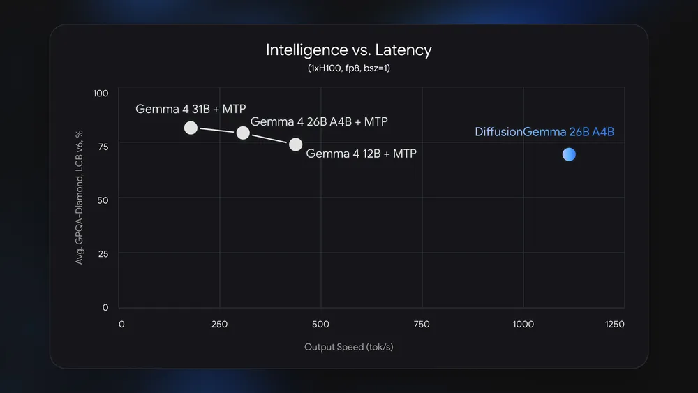
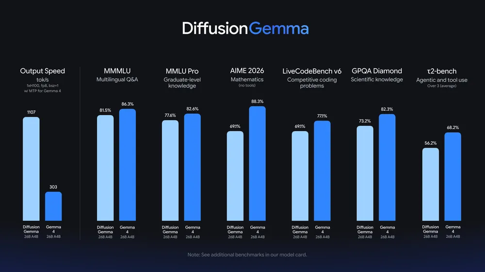

# Reference Thread: DiffusionGemma

## Post 1

Google released **DiffusionGemma** on June 10. It is an experimental open model in the Gemma 4 family that generates text with diffusion instead of the usual one-token-at-a-time decode.

The claim is speed, not top quality. Google says it can hit **1000+ tokens/sec on one H100** and **700+ tokens/sec on an RTX 5090**, up to **4x faster** than comparable autoregressive Gemma generation in the local setup it targets.

The tradeoff is explicit: Google says standard Gemma 4 is still the better choice when output quality matters most. DiffusionGemma is aimed at local, low-concurrency work where waiting on decode hurts the loop: inline editing, code infill, local agents, and structured generation.

---

## Post 2

The basic mechanic is different from normal LLM serving.

Most language models write left to right. DiffusionGemma works on a **256-token canvas**. It starts with placeholder tokens, then repeatedly denoises the block while each token can attend to the rest of the block.

For longer outputs, it commits a finished block to cache, then starts the next block. That keeps some left-to-right structure for long text, but the work inside each block runs in parallel.

Google’s own docs say the speedup is strongest for consumer-facing, low-concurrency local use. In high-QPS cloud serving, normal autoregressive models can already batch enough requests to keep the hardware busy.

---

## Post 3

The hardware fit is part of the release.

DiffusionGemma is a **26B Mixture-of-Experts model** with about **4B active parameters** per step. Google says the quantized model fits within **18GB VRAM**, which puts it near high-end consumer GPUs instead of only cloud accelerators.

That does not make it a general replacement for hosted frontier models. It makes it more like a fast local workhorse for narrow loops where responsiveness matters and the user can tolerate a quality drop.

---

## Post 4

The benchmark table shows the quality trade.

On Hugging Face, DiffusionGemma 26B A4B trails Gemma 4 26B A4B on several model-card benchmarks:

- **AIME 2026 no tools:** 69.1% vs 88.3%
- **LiveCodeBench v6:** 69.1% vs 77.1%
- **Codeforces ELO:** 1429 vs 1718

That matters more than the headline speed number. If you need the best answer, use the standard model. If you need many fast passes, a local edit loop, or a bidirectional infill shape, this is the part worth testing.

---

## Post 5

Google shipped the model with real paths to try it.

The weights are on Hugging Face under Apache 2.0. The model card lists Transformers, vLLM, SGLang, Docker Model Runner, quantizations, Colab, Kaggle, and local-app paths. Google’s docs also list Vertex access.

NVIDIA says it has optimized DiffusionGemma across RTX, RTX PRO, DGX Spark, and DGX Station, with NIM as another route. Google says llama.cpp support is coming soon, so that should be treated as pending, not done.

There is also a fine-tuning example around Sudoku. That example fits the model shape: later tokens constrain earlier tokens, so bidirectional denoising can help more than plain left-to-right generation.

---

## Post 6

HN discussion is already focused on the right questions.

The launch thread had **326 points and 88 comments** when checked. People were less interested in the name than the tradeoffs: local speed, quality loss, cloud-serving economics, and whether diffusion decoding behaves well for tool calls or strict output formats.

One practitioner described the fast-model use case as closer to pair programming than waiting for a big agent run:

> My unexpected favorite model to use was Mercury (a diffusion model). Not because it was “smart” but because it was stupid fast.
> _**Hacker News comment, launch thread**_

Another comment put the main caveat plainly:

> diffusion models perform somewhat worse than autoregressive on text. So you lose some performance. Speed is the big advantage.
> _**Hacker News comment, launch thread**_

That is the frame to keep: fast local loops, with real quality and tooling questions.

---

## Post 7

Sources:

Main sources:
- Google launch blog: https://blog.google/innovation-and-ai/technology/developers-tools/diffusion-gemma-faster-text-generation/
- Google AI model overview: https://ai.google.dev/gemma/docs/diffusiongemma
- Hugging Face model card: https://huggingface.co/google/diffusiongemma-26B-A4B-it

Extra context:
- Google developer guide: https://developers.googleblog.com/en/diffusiongemma-the-developer-guide/
- NVIDIA writeup: https://blogs.nvidia.com/blog/rtx-ai-garage-local-gemma-diffusion/
- Hacker News discussion: https://news.ycombinator.com/item?id=48478471
