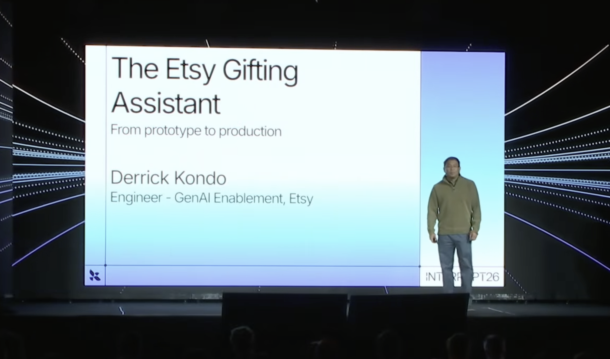
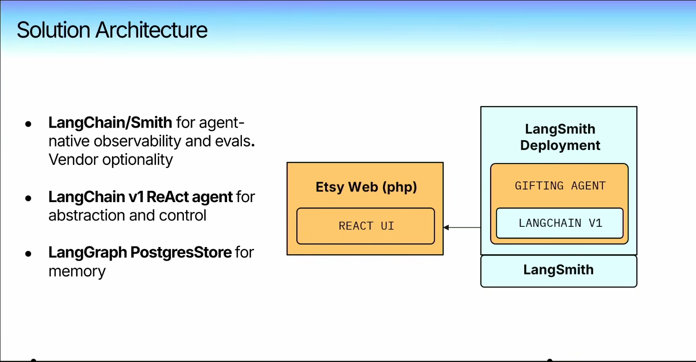
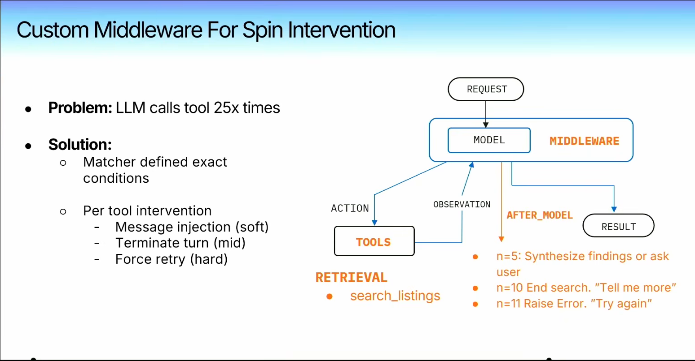
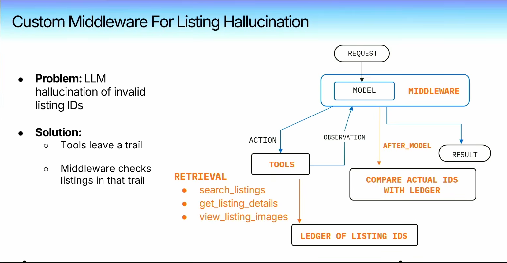
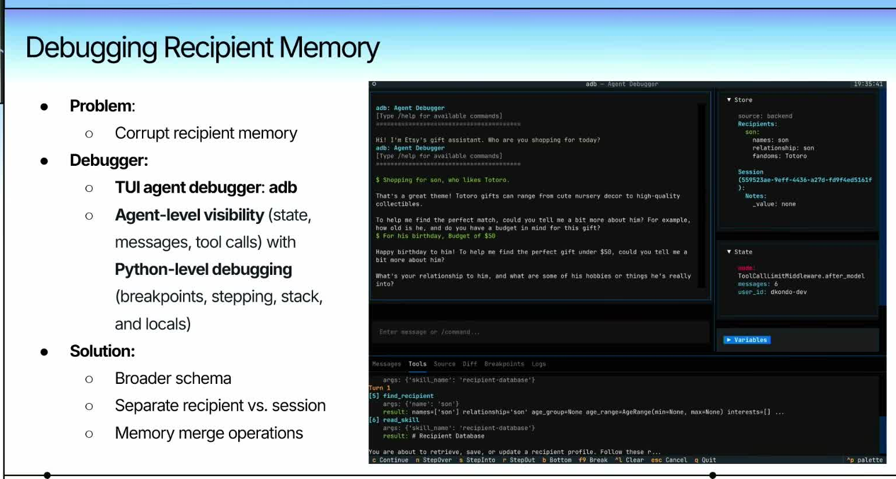
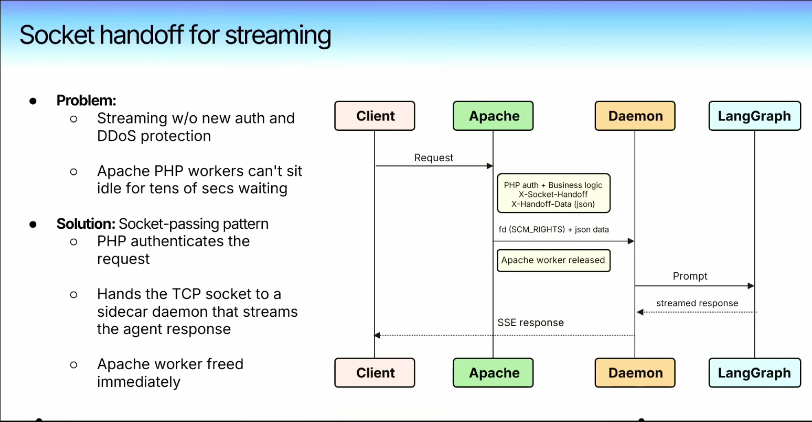
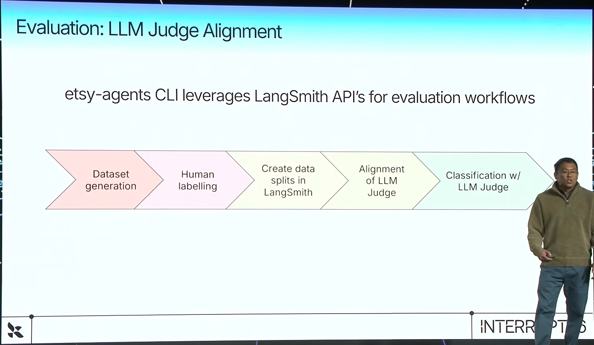

# Reference Short Thread: Etsy Gifting Assistant

## Post 1

LangChain uploaded Derrick Kondo's Interrupt 26 talk on Etsy's Gifting Assistant. Kondo is a Staff Software Engineer on Etsy's GenAI Enablement team.

The assistant helps shoppers find gifts in Etsy's messy marketplace. The hard part is that buyers often describe a person, mood, budget, or occasion, while sellers list handmade or vintage items with uneven text and image-heavy details.

Etsy says the team got a beta into production in about six weeks with three senior engineers and one designer.

---

## Post 2

Etsy used a LangChain v1 ReAct agent through LangSmith Deployment. Etsy Web stayed in PHP with a React UI, and recipient memory lived in a LangGraph PostgresStore.

The tools match the shopping task: search listings, fetch listing details, inspect listing images, find recipient profiles, and save memory. The agent sits above Etsy search and tries to turn vague gift intent into a small set of candidate listings.

---

## Post 3

Kondo covers three failure modes Etsy hit after moving past the basic agent loop.

One was search spin. The model sometimes called the same search tool again and again, so Etsy added middleware that watches repeated calls and interrupts the loop.

Another was listing ID hallucination. Search tools write seen listing IDs into a ledger; later, middleware checks the model's chosen IDs against that ledger before showing results.

For memory, he gives a specific bug: the model stored a T-shirt size under `interests`. Etsy built a terminal agent debugger for state, messages, tool calls, store snapshots, semantic breakpoints, and Python-level stepping. That pushed the team toward a broader recipient schema, separate recipient/session state, and explicit memory merge operations.

---

## Post 4

For streaming, Etsy kept PHP/Apache in front for auth and request security. It handed the TCP socket and request data to a sidecar daemon, released the Apache worker, and let the daemon stream server-sent events while LangGraph handled the long agent run.

---

## Post 5

For evals, Etsy split the question into trajectory and output.

Trajectory checks whether the agent did the expected thing often enough, such as calling the right tool across repeated nondeterministic runs. Output checks whether the final gift recommendations matched the recipient profile and budget.

They used simulated conversations, merchant labels, reviewer agreement checks, train/validation/test splits in LangSmith, and judge-prompt tuning before putting the judge into the workflow.

---

## Post 6

Sources:

Main source:
- YouTube talk: https://www.youtube.com/watch?v=CS5HojyZ5FE

Background:
- Derrick Kondo GitHub: https://github.com/dkondo
- `agent-tackle-box`: https://github.com/dkondo/agent-tackle-box
- Personal site: https://dkondo.github.io/
- LangGraph middleware post: https://dkondo.github.io/posts/ace-langgraph-middleware/
- Interrupt 2026 overview: https://www.langchain.com/blog/interrupt-2026-overview
- LangSmith Platform: https://www.langchain.com/langsmith-platform
