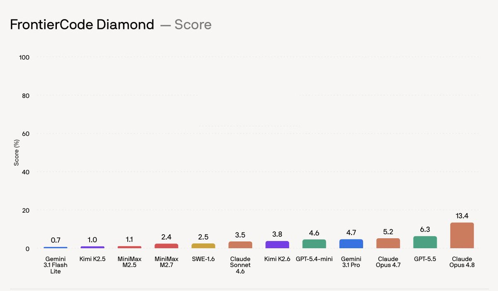
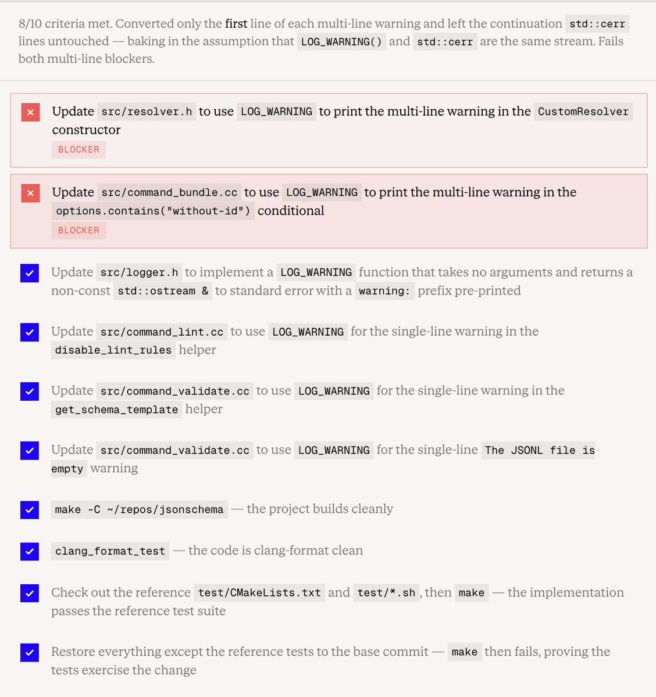
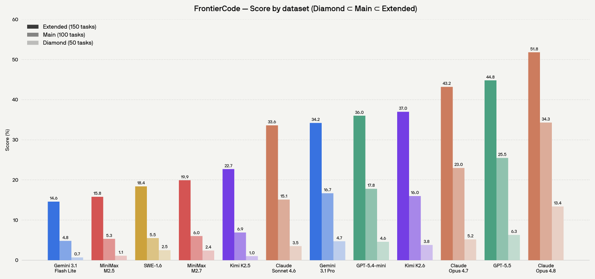
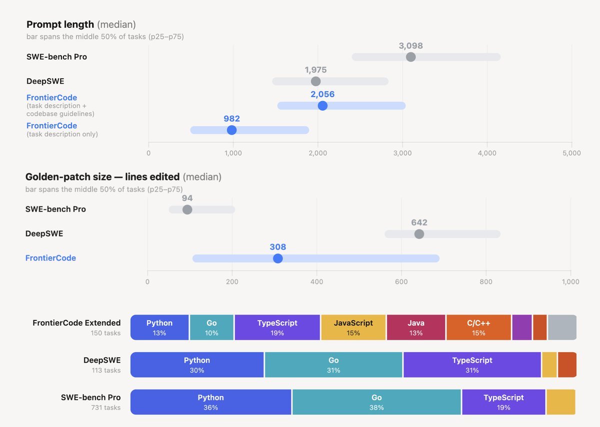
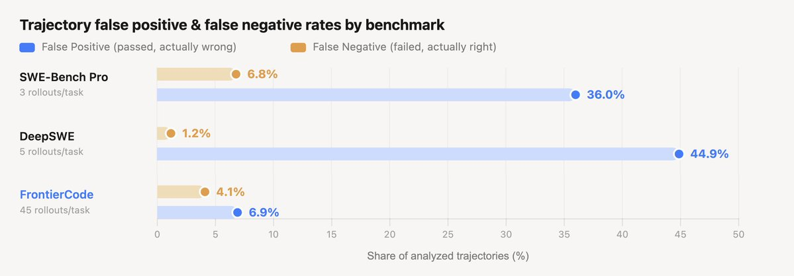
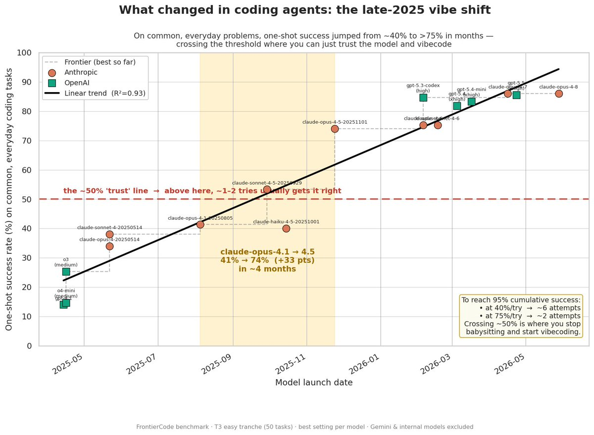

# Reference Thread: FrontierCode

## Post 1

Cognition released **FrontierCode** on June 8. Cognition is the Devin company, so this is a company-run benchmark from a coding-agent vendor, not a third-party eval lab.

The new target is mergeability. Instead of asking only whether an agent can pass tests, FrontierCode asks whether the patch would clear a maintainer review: correct behavior, useful tests, limited scope, project style, and code quality.

On the hardest Diamond split, Cognition reports Claude Opus 4.8 at **13.4/100**, GPT-5.5 at **6.3**, and Gemini 3.1 Pro at **4.7**. Cognition is arguing that current agents can pass a lot of coding tests, but still fail the “would this be merged?” bar.

This got real attention on X, roughly 2.5M impressions on the launch post. Reddit discussion was smaller and more skeptical, mostly because the ranking favors Claude and the benchmark is not public.

---

## Post 2

The main difference is the grader.

FrontierCode tasks have blocker and non-blocker criteria. A solution passes only if it clears all blocker criteria. Then the score comes from the rest of the rubric.

That lets the eval catch failures that normal unit tests miss. In Cognition’s example, Opus 4.8 writes code that behaves the same today, but mixes `LOG_WARNING()` with raw `std::cerr` in a way the maintainer says bakes in a bad assumption for future changes.

So the benchmark is trying to grade the kind of thing a senior reviewer would flag: not “does this line execute,” but “is this patch something we want in the codebase?”

---

## Post 3

The result set has three nested splits:

- **Extended:** 150 tasks
- **Main:** 100 hardest tasks
- **Diamond:** 50 hardest tasks

Cognition reports Opus 4.8 leading all three: **51.8** on Extended, **34.3** on Main, **13.4** on Diamond.

GPT-5.5 is lower on score, but Cognition also says it uses up to 4x fewer tokens than Opus 4.8, so the cost picture is not identical to the quality ranking.

Open models are still far behind in this release. Cognition says Kimi K2.6 is the best open model they tested, at **37** on Extended, **16** on Main, and **3.8** on Diamond.

---

## Post 4

FrontierCode sits close to SWE-Bench Pro and DeepSWE, but it is aiming at a different failure mode.

SWE-Bench Pro has longer prompts. DeepSWE has larger reference patches. FrontierCode uses shorter task descriptions than both, then leans harder on review criteria.

That matters because the benchmark is trying to test whether the agent can infer intent from sparse instructions and repo norms, instead of only following a highly specified issue.

The language mix is also broader than SWE-Bench Pro. The source chart shows FrontierCode including Python, Go, TypeScript, JavaScript, Java, C/C++, and a smaller tail of other languages.

---

## Post 5

The prior-art link is METR’s March result on SWE-Bench Verified.

METR had real maintainers review 296 AI-generated PRs that passed the SWE-Bench automated grader. Their summary: roughly half of those test-passing PRs would not be merged.

Cognition is building directly on that criticism. Their claim is that FrontierCode has much lower false positives and false negatives than SWE-Bench Pro and DeepSWE, because every task goes through adversarial testing, calibration, multi-stage review, and manual Cognition review.

Cognition’s process is aimed at the coding-eval complaint: agents can produce code that passes a benchmark but still would not survive review.

---

## Post 6

Outside discussion mostly split into two camps.

swyx framed FrontierCode as the next benchmark era after HumanEval and SWE-Bench: autocomplete, then passing tests, then maintainable code. He also connected it to METR’s “unmergeable” SWE-Bench finding.

> Three eras of AI coding : Three eras of benchmarks
>
> 2021 • Autocomplete : HumanEval
> 2023 • Passing Tests: SWEBench, TerminalBench
> 2026 • Maintainable Code: FrontierCode
> _**swyx on X, 783 likes, 79 reposts, 187k impressions**_

Reddit was more skeptical. The r/codex post had about 200 score and 69 comments when checked. The top comments pushed back on the Claude-heavy ranking:

> No way Claude is 2x better than GPT 5.5
> _**r/codex comment, 135 upvotes**_

> Paid for and brought to you by Anthropic
> _**r/codex comment, 20 upvotes**_

There was also a quieter positive comment:

> this does seem like the sort of comparison we should want to exist
> _**r/codex comment, 1 upvote**_

The response is mixed: people want this kind of eval, but they do not yet trust this exact leaderboard.

---

## Post 7

The main access constraint is that the tasks are closed.

Cognition says the tasks are not public:

> we don’t currently plan to release the tasks publicly to avoid contamination
> _**Cognition blog, official source**_

They say model creators can submit to the eval, but outside users cannot run it like a normal open benchmark.

That makes FrontierCode different from an open benchmark you can run locally. For now, the numbers are Cognition-reported results until more outside groups can compare against it or pressure-test the ranking.

---

## Post 8

Sources:

Main sources:
- Cognition launch post: https://x.com/cognition/status/2064061031912288715
- Cognition blog: https://cognition.ai/blog/frontier-code

Source context:
- METR note on SWE-Bench passing PRs and maintainer review: https://metr.org/notes/2026-03-10-many-swe-bench-passing-prs-would-not-be-merged-into-main/

Public discussion:
- swyx thread: https://x.com/swyx/status/2064081945567580323
- r/codex thread: https://reddit.com/r/codex/comments/1u0kl6l/new_coding_eval_that_raises_the_bar_for/
