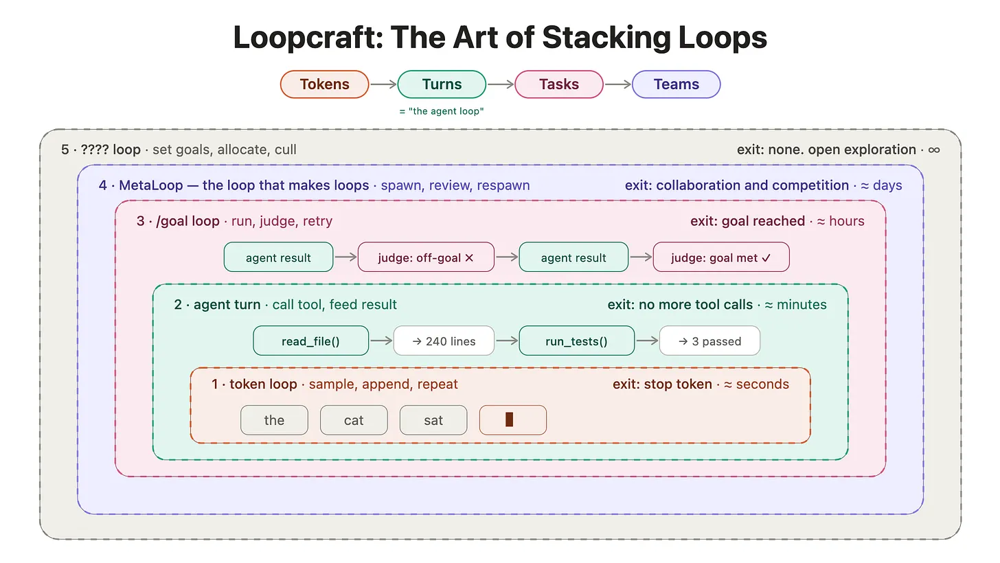
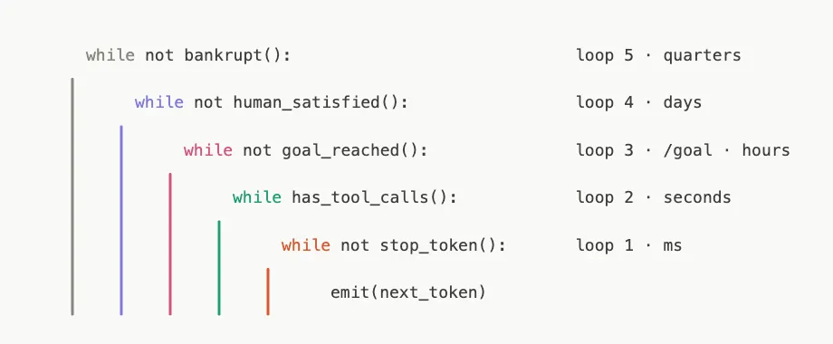

# Reference Message: LoopCraft

Latent Space has a clean name for the current coding-agent pattern: **LoopCraft**.

The point is that the work is moving from writing better one-off prompts to designing loops that keep prompting agents for you. swyx’s version is the simple rule: go down a loop when something breaks and you need reliability; go up a loop as models improve and you want more output from the same human input.

It ties together Peter Steinberger’s “design loops that prompt your agents,” Boris Cherny’s “the loops do the work,” and Karpathy’s point that the human becomes the bottleneck once every next step still needs a manual nudge.

_The first diagram shows the nested model: tokens sit inside tool-call turns, turns sit inside tasks, and tasks sit inside teams. When one loop needs too much manual babysitting, you move up a level and wrap it in a bigger loop that can retry, judge, allocate, or spawn more work._

_The second diagram is a concrete example of that stack. A token loop runs in milliseconds, a tool-call loop in seconds, a goal loop in hours, a meta-loop in days, and team direction over quarters._

https://www.latent.space/p/ainews-loopcraft-the-art-of-stacking

https://x.com/swyx/status/2065307558198567206

