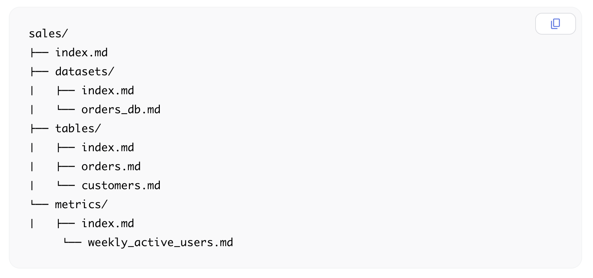
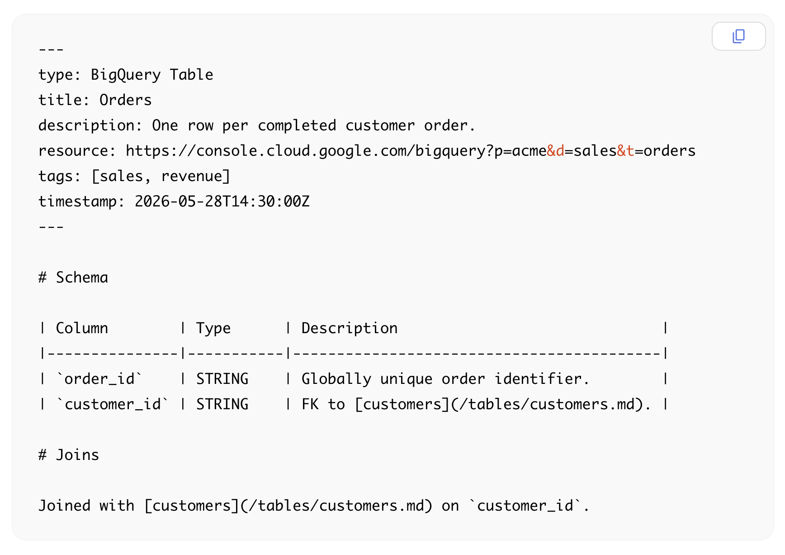

# Reference Thread: Open Knowledge Format

## Post 1

Google Cloud introduced **Open Knowledge Format v0.1**, a small spec for agent-readable knowledge bundles.

It is not a new Markdown flavor. It is closer to Obsidian-compatible Markdown with a small shared contract for exchange.

The syntax is familiar: Markdown files, YAML frontmatter, folders, and links. The OKF part is what tools can count on. Every normal `.md` file is one concept. The file path is the concept ID. Every concept has a required `type`, like `BigQuery Table`, `API Endpoint`, `Metric`, or `Playbook`. That type is human-readable, not a central enum, so consumers are expected to handle unknown types gracefully. `index.md` means directory guide, `log.md` means history, and Markdown links connect concepts.

That gives agents, catalogs, search tools, and viewers a predictable way to list concepts, group them by type, follow relationships, and move the bundle between tools without learning one team’s private note style.

_The screenshot shows the contract in file form: `tables/orders.md` is the stable ID for the Orders table, and `metrics/weekly_active_users.md` is the stable ID for that metric._

---

## Post 2

Google also shipped a repo with the spec, sample bundles, and two demo tools.

One demo writes OKF from BigQuery metadata: table files, view files, schema notes, joins, and citations. Another reads any OKF bundle and renders it as a static HTML graph.

Those demos are there to show the producer/consumer split. A BigQuery exporter, graph viewer, search index, catalog, or agent can all work with the same folder if they follow the same bundle contract.

_The screenshot shows one concept file. The frontmatter gives tools fields they can rely on: type, title, resource URL, tags, and timestamp. The Markdown body keeps the schema and join notes readable for humans and models._

---

## Post 3

Sources:

- Google Cloud blog: https://cloud.google.com/blog/products/data-analytics/how-the-open-knowledge-format-can-improve-data-sharing/
- OKF repo: https://github.com/GoogleCloudPlatform/knowledge-catalog/tree/main/okf
