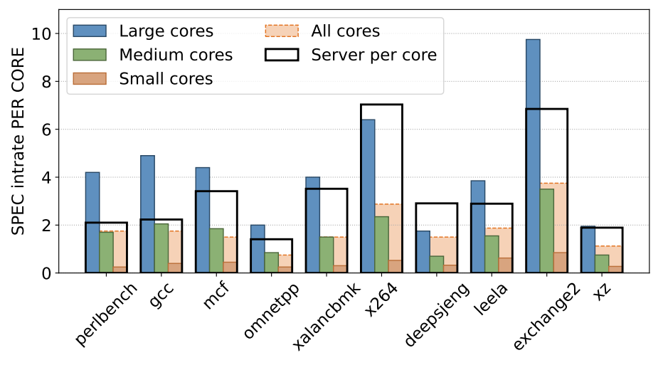
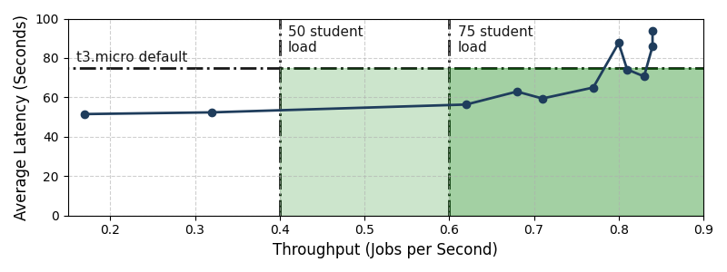

# Reference Message: Retired-Phone Compute

Google Research says UC San Diego is turning retired Pixel phones into a small compute platform.

They strip each phone down to the motherboard, replace Android userspace with Linux, and run containerized jobs through Kubernetes clusters of 25-50 devices. The planned Fall 2026 deployment is 2,000 phones, roughly 50 server-equivalents by Google’s comparison.

In the early test, a 20-phone cluster handled peak grading submissions for a 75+ student parallel computing class with lower latency than the default AWS backend. The thing still to prove is durability under sustained datacenter use.

_*The first chart is why the idea is plausible:* a recent Pixel's large cores beat the sampled server core on several single-threaded SPEC tests. One phone is not a server, but dozens of phone boards can add up._

_*The second chart is the class-grading test.* The green area is where the 20-phone cluster meets the throughput and latency target; the plotted points show it staying under the t3.micro default latency until the load gets high._

https://research.google/blog/a-low-carbon-computing-platform-from-your-retired-phones/

