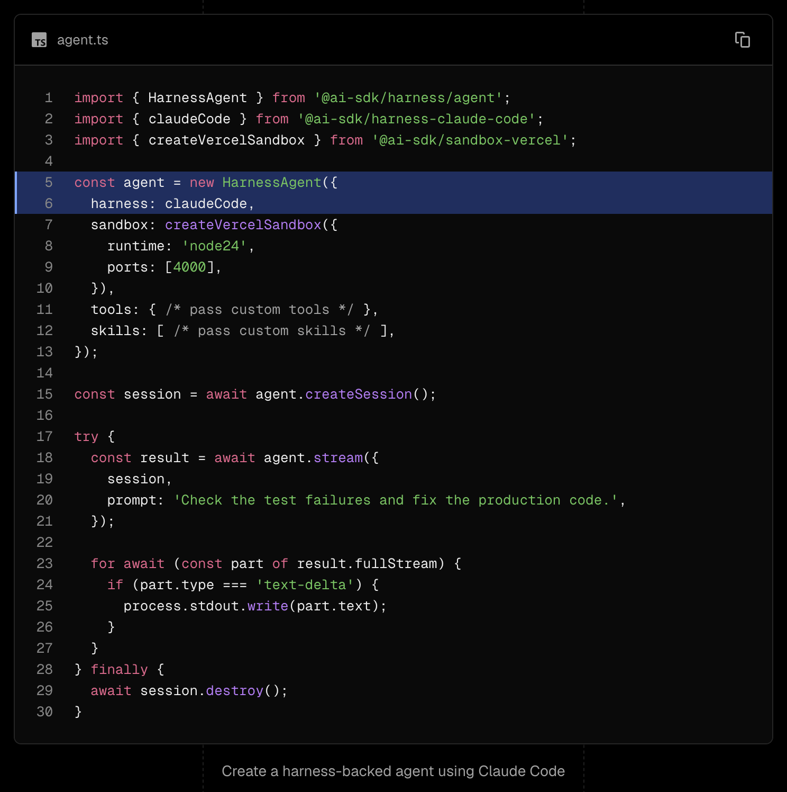

# Reference Message: Vercel AI SDK HarnessAgent

Vercel added an experimental `HarnessAgent` layer to AI SDK 7 canary.

It lets an app call agent harnesses like Claude Code, Codex, and Pi through the same AI SDK shape: create a session, run it in a sandboxed workspace, and consume `generate()` or `stream()` results in the existing AI SDK flow.

Vercel is trying to make agent harnesses swappable the way AI SDK made models swappable. It is canary-only for now, and the harness packages are marked experimental.

_The screenshot shows the whole API shape: import a harness adapter, pass it into `HarnessAgent`, create a sandboxed session, then stream the agent output back through AI SDK._

https://vercel.com/changelog/program-agent-harnesses-with-ai-sdk

